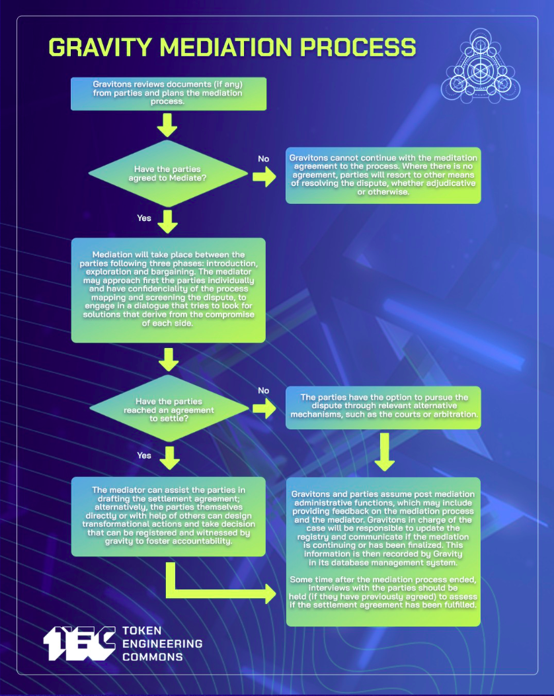

# Conflict Management

- [Gravity easy Step by Step](https://forum.tecommons.org/t/gravity-easy-step-by-step/354)
  > Functions for Alternative Dispute Resolution in DAOs 1. Identification: One of the parties to a dispute approaches Gravity and requests a mediation. Gravitons can also propose issues to manage and discuss. 2. Screening: The parties provide the Gravitons assigned all the relevant information pertaining to the dispute and are invited to participate in a mediation process 3. Look for solutions: Gravity offers premises to frame the dispute in a non adversarial way and to conduct the mediation pro...

## Contents
- [Steps for Alternative Dispute Resolution](#steps-for-alternative-dispute-resolution)
- [THE 4 P’s - FRAMEWORK FOR CONFLICT ANALYSIS](#the-4-ps---framework-for-conflict-analysis)
  - [The 4 Ps key factors](#the-4-ps-key-factors)
- [Gravity Mediation Process](#gravity-mediation-process)
- [Assorted Graphics](#assorted-graphics)
- [Community Resources](#community-resources)
  - [Mediation](#mediation)
  - [Alternative Dispute Resolution](#alternative-dispute-resolution)
  - [Conflict Transformation](#conflict-transformation)
  - [Negotiation](#negotiation)
  - [Restorative Justice](#restorative-justice)
  - [Nonviolent Communication](#nonviolent-communication)

## Steps for Alternative Dispute Resolution

**First**, One or more of the parties to a dispute approaches Gravity and requests support. Gravitons can also propose issues to manage and discuss.

**Second**, The parties provide the Gravitons assigned all the relevant information pertaining to the dispute and are invited to participate in a mediation process that requires their good will and involves a meaningful communication process with caucuses and 

**Third**, Gravity offers premises to frame the dispute in a non adversarial way and to conduct the mediation process aiming to reach a settlement agreement. Gravity keeps a copy of internal forms for evidence and registry.

**Fourth**, Gravity acts as a witness and facilitator of the settlement of the dispute and keeps track of agreements and follow up, but each part acquires responsibilities associated with implementation. if the issue persists, it can scale to other Dispute resolution mechanisms for arbitration or litigation.

## THE 4 P’s - FRAMEWORK FOR CONFLICT ANALYSIS

| | | 
| --- | --- |
| **Possible solutions**   Comparing with references and similes, exploring alternatives, testing the legitimacy of agreements, planning, foreseeing reactions, follow up mechanisms.   (Formulating requests) | **Problem**   Context, Arguments, Aspirations, Scale/Reach of conflict, Recognition, Willingness   (Understanding Feelings) |
| **Process**   Triggering events, ways of fighting, management given, communication,  Chronology.   (Identifying needs) | **People**   Who are the actors?, What is their relationship of power?, What are their interest?   (Observation process) |

The 4 Ps are an iteration of the PPP model [https://www.law.ox.ac.uk/business-law-blog/blog/2017/03/ppp-negotiation-model-problem-people-and-process](https://www.law.ox.ac.uk/business-law-blog/blog/2017/03/ppp-negotiation-model-problem-people-and-process) 

### The 4 Ps key factors

| Category | Variable | Definition | 
| --- | --- | --- |
| **People** | Main and secondary actors | Who and how many are the parties involved |
| | Power relationship between actors | Institutions and play rules |
| | Feeling of the actors in the conflict (perception) | Emotions triggered and needs at stake |
| **Problem** | Ingredients of the primordial soup | Context, factors that enable the conflict |
| | Faced arguments that boost the conflict | Central aspect of the dispute |
| | Interest that are represented by the parties | Desires, expectations and aspirations of the parties |
| | Reach of the conflict | Scale, status and potential impact of the conflict |
| | Acknowledgement of the conflict | Recognition of the conflictive situation by the parties |
| **Process** | Triggering events and escalation dynamics | facts that have marked the evolution of the conflict |
| | Ways that the conflict has developed | Forms of struggle, interaction with the conflict | 
| | How has the conflict been managed | Communication between actors, who are supportive third parts |
| | Chronology of the conflict | Timeline and time lapse of the situation |
| | Signals for possible escalation | Sensitive topics and actions that can trigger an escalation of the conflict |
| | Comparison with similar conflicts and references | Comparative method |
| **Possible solutions** | Exploring alternative paths for solutions | Multiple answers and possible ways that the conflict can unfold |
| | Legitimacy of decisions | mechanisms to make binding decisions |
| | Envision possible future scenarios | Prospecting and preventing social responses |
| | Mechanisms of implementation | Follow up and accountability for parties responsibility |
| | Short term responses | immediate actions with a direct impact on solving the dispute |
| | Long term transformative actions | Strategies that can help to prevent conflict and build trust | 

## Gravity Mediation Process

**Mediation flow** 
- Needs the good will of the parties to engage in a meaningful communication process, without this, there are other means of resolving disputes that can be more effective and efficient.
- We make caucuses (private meetings) with all the parties involved to identify common ground and prepare a joint conversation
- The post mediation process can be outlined in settlement agreements, but also gains legitimacy from follow up and implementation 

## GUIDING QUESTIONS 

Not talking about the past
Not pointing out individual responsibilities, avoid focusing on names
It's not necessary to make all the questions at once, when people start opening, catch the relevant information.

- How do we end something not desired and build something we do desire?
- Could you describe the conflicting situation that happened?
- What happened?
- Why do you think it happened?
- What would be the best possible outcome for you?
- What are you willing to compromise / negotiate in this process?
- What would be the worst case scenario for you in this situation?
- How would you like to feel after what happened? 
- What are your needs in this situation?
- What do you think can be done to restore the relationship and build trust?
- What can we learn from this?
- How can we apply these learnings?

## GRAVITY FORMS 
(FREE TO USE - JUST FORK THEM)

**First approach**: Hello XXXX How are you? my name is XXXX and Im a facilitator of conflict management in DAOs. Thank you for your input to the Gravity typeform. I'm reaching out with the intention of supporting meaningful communication processes, and building common ground for possible agreements that meet the needs of the parts involved. Would you be interested in having a meeting to talk on the issue? 

- [Observation form](https://docs.google.com/document/d/1LbytXdLBu3XC9BBTQA6aiZYPC02j-fxcRoiqtUDdGyg/edit)
- [Mediation form](https://docs.google.com/document/d/1RgL9QANBhq6KqtETCYEEEsFSJvHUw0K5VD58qWPUBTk/edit)
- [Venn Diagram (OFNR + 4Ps)](https://docs.google.com/presentation/d/1vZsWR6mO8aFRvpjuILmfVYlQXRVg_SxTvuvErjtinCg/edit?usp=sharing)

## MAPPING OBSERVATION PROCESS BATNA

## KEEPING A REGISTRY FOR TRANSPARENCY AND ACCOUNTABILITY
We use [Dework](https://app.dework.xyz/gravity-dao/trust-creation-trai), integrated with zenhub and Discord

## Designing an agreement

Google docs are ok, but we are soon moving to Unbreakable vows

https://unbreakable-vows.on.fleek.co/#/create

## Conflict Transformation Platform

## OFNR + 4 Ps

## Steps Typically Used by a Private ADR Center

## Identify bright lines for formal legal process (including mediation/appeal)

* optional/restorative/compulsory community service
* correct/muting/removal of prior communications on social channels
* suspension/expulsion as member/participation
* Monetary penalty … forced burning, transfer or lock-in of tokens
* Consider purchasing ADR tokens (alternative dispute resolution hours) from LexDAO for the complicated situations

Following a dialectical approach, there should be at least three filters required for the bot/typeform to accept a conflict management request inside the system and be able to start working around it.

A. Is this information true? (the caller signs the information sent)
*Calling for conflict management with false statements should be a low-mid sanction.

B. What are the social agreements at risk in this situation
*Sustaining how this behavior is contrary to the organization ethics.

C. Why is addressing this issue useful for the system?
*Stating how can the community/members benefit for a call on this issue

As the proposed authority comes from consensus, the sanctioned should accept the sanction (sign it) in order to be legitimate. If the sanctioned does not agree with the sanction or feels that they are being harmed in other ways, there can be a presentation of counter-arguments that will begin a negotiation process with a TEC SME in conflict management and the involved members to look for solutions.

## Scalability of disputes 

Following alternative mechanisms of conflict management, we can propose strategies to deal with the scaling of disputes that cannot be easily managed with the graduate sanctions. This scope involves the active participation of qualified third parties to play the role of facilitators that help building communication bridges in non consensual situations where the parts keep pushing away from each other. These are paths suggested to suit the complexity of conflicts.

1. Negotiation: - The issue is private -  Decisions can be settled easily between the parts and a SME in conflict management. Light sanctions can be applied.
2. Mediation: - The issue is still private - The parties can agree to ask for support from a group of trusted members inside the community (not related to any of the parties), to help find solutions. They will suggest a path to proceed, but the implementation of the decision depends on the consent of both parties involved. Yellow cards can be applied.
3. Conciliation: The issue is still private  – The parts can agree to ask for support from a group of trusted members inside the community (not related to any of the members) that helps in the design, voting, and implementation of solutions that should be respected by all parts. Red cards can be applied.
4. Arbitration: The issue becomes public after having exhausted the previous mechanisms without reaching agreements - The parts can call for help to an external organization – trusted by all parts (like kleros - aragon courts - Celeste)  - that should review the process and work towards regaining governance by proposing alternatives, that should be voted inside the system to be legitimated and implemented. Red cards can be applied.

Based on: https://dialnet.unirioja.es/descarga/articulo/4182033.pdf

## Draft for the conflict resolution program of the TEC which can eventually support other DAO communities. 

1. We could have conflict management training twice a year, each one ending with a conflict management certification.
2. People who pass the training and show they have soft skills and understanding of conflict can become part of this trusted group of conflict management supporters for the TEC. 
3. That will provide the minimum requirements, but then we need to develop a reputation system to promote meritocracy and good will. A person can not be part of the conflict managers more than 3 years in a row to promote rotation and avoid centralization of power. He/she can join again after 1 year of not being part of this group.
4. Agreements and sanctions as products (actions) of conflict management processes, are registered in the system database (off-chain) with follow up indicators for accountability. - My idea is that we could have some kind of system that holds the proof and information needed to revise and solve cases- maybe?. Ex. A member publishes some information as his own. The community should be able to record the situation, the decision taken for that case, and look for a way to track the progress. 
5. What type of conflicts will they be able to manage? Mostly common conflicts related to unwanted organizational behavior, disputes between members and non consensual situations.  The objective of this program is to handle small disputes with ease and provide preventive/de-scaling management for bigger issues. 
6. This is a voluntary process that can be called by one or part, but to proceed there should be recognition of the process by all parts involved.
7. The conflict management process does not end in agreements or sanctions. After them, there should be Indicators and off-chain follow-up.
8. The Conflict management process should be rewarded for the people doing this job.

## TABLE 1.5 Steps Typically Used by a Private ADR Center
* Alternative Dispute Resolution Center Manual A Guide for Practitioners on Establishing and Managing ADR Centers

1. One of the parties to a dispute (referring party) approaches the ADR Center and requests a mediation.
2. The ADR Center provides a list of names of available mediators from which the parties may elect their mediator.
3. The parties provide the ADR Center with all the relevant documents pertaining to the dispute, and the ADR Center provides this information to the mediator.
4. The ADR Center, in consultation with the parties and the chosen mediator, determines the date and place when the mediation will take place. The ADR Center may offer premises for conducting the mediation. A few hours or a number of days may be allocated for the mediation, depending on the complexity of the matter and the number of parties involved.
5. If the dispute is settled through mediation, the parties enter into a Settlement Agreement. Often the ADR Center will keep a copy of the Settlement Agreement on file for its records.
6. If the dispute remains unresolved, the referring party may request that the matter be arbitrated by the ADR Center, if this is the agreed process to be followed by the parties (for example, in terms of the contract between the parties). Alternatively, the parties may agree to arbitration. If the parties do not agree to arbitration , they may follow the recognized route for resolving disputes in that jurisdiction (for example, approaching the court for a court order).
7. Once again, the parties will elect an arbitrator. The arbitrator will conduct the arbitration on a date and at a time as agreed between the parties.
8. The arbitrator adjudicates the matter and provides an arbitration award, which is normally binding between the parties through operation of law or by agreement of the parties.

## Brainstorms
Brainstorm with Loie (12 Oct). what does the conflict resolution process include:
* It’s clear who facilitators/supporters are - ¿should there be rotation /how to do it?
* Pre-circling (facilitators interview stakeholders)
Identify the other stakeholders (who else needs to be involved)
Get a definition of what happened (as neutral as possible - description of events. Helpful here to use Who What Where When questions, no How or Why)
* All stakeholders need to accept the definition of what happened
* Circle (meeting with all stakeholders)
Action Steps (equivalent of justice circles)
* Set a date in future to evaluate if these have been followed
Setting a safe space
* Reminding what our mission/principles are (the stuff that holds us together)
* Making it clear what pieces are confidential/what aren’t (for example Action Steps may be public but all other elements of the meeting are kept confidential)
* Facilitator is not a Judge, more of an external person that promotes communication, de-scaling of the problem and searching for solutions within different scopes.
* Accountability of the agreements/action steps
What happens if you break the agreements?*** 
Graduated Sanctions + positive reinforcement 
* “Post Circle” - 1 month-6 months later check in on if agreements are being followed.
* Clear process for when & how agreements are revisited/changed
* It’s an internal program - the facilitators should be IN the community

Clear list of who is this list of people that plays this role in the organization 
How does it rotate for avoiding power centralizations?
Knowing when a facilitator is unable to be an impartial third in a situation.

It Could be a little difficult until we have the 1st training. Once people in the community have gotten trained as conflict supporters, we can use people from within the community

### Brainstorm with griff (18th Oct):

Thermometer of unwanted behavior 

If someone disagrees with the group sanction, there can be an arbitrage (like kleros-aragon courts).

### Other Brainstorm points

* Knowing when this process doesn’t apply

### Brainstorm with Livia (28 oct)

#### How Could the cycle be?
what if for the conflict res we can do something as the Dish prase, but private, like people send their query to a bot, and then a conflict manager contacts him/her for knowing more info on the report.

Then unwanted behavior is measured periodically following tiers, and related to sanctions if needed

like what you and griff to for impact hours, but this would be on reports about disputes

like, i think there should be a distributor figure (cifra repartidora) that distributes equal quantities of cases to this group of people

but they sould have also responbilities as a group, being accountable of some things in the community's well being

i thought about the bot because it's very simple and private, just sending a message connects you to someone that understand that the community's well being is related to individual wellbeing

## Academic references 
- Harvard’s program on negotiation
To sign up to receive the Teaching Negotiation Resource Center email newsletter, click here.
If you would like to learn more about negotiation books, role-play simulations, and other materials available through the Teaching Negotiation Resource Center, you can reach us at tnrc@law.harvard.edu.
  

Include conflict resolution in Founding documents

The Mexican Cooperative law gives some examples of conflict resolution within a cooperative, I know that law, we can talk on that :) [Am Humberto] - Nice! I’m suggesting monday calls.

Related links

https://oscr.umich.edu/article/restorative-justice-circles

https://hbr.org/1990/01/five-ways-to-keep-disputes-out-of-court

https://docs.google.com/document/d/18GF3f130miEsaASw-TRCHR-qRtbL8y-UsfusV7pXuZg/edit# D2D reputation sharing

https://handbook.enspiral.com/agreements/catalyst Enspiral “catalyst”

## Community Resources

- [Jur](https://jur.io/) – Justice. Decentralized
- [Conflict Resolution: Towards Problem Solving – John Burton](https://core.ac.uk/download/pdf/51092982.pdf)
- [How to solve conflict in a community of equals](https://media.ccc.de/v/rc3-channels-2020-125-how-to-solve-conflict-in-a-community-of-equals) 
  > This talk provides a practical guide for how to solve interpersonal conflict in communities with a loose structure such as do-ocracy or anarchy
- [The Great Courses - Art of Conflict Managment](https://www.thegreatcourses.com/courses/art-of-conflict-management-achieving-solutions-for-life-work-and-beyond) 
- [Dominic Barter - Dedicated spaces for having conflicts](https://www.youtube.com/watch?v=xhi8sxCPkvo) 
- [Dominic Barter - Understanding justice as a system](https://www.youtube.com/watch?v=z-CIeYopMnM) 
- [A New Way to Look at Conflict Resolution - How to Have Healthy Workplace & Community Relationships](https://www.youtube.com/watch?v=SNw1z3VDWsI) 
  > Looking for a new way to look at conflict resolution in 2020? What is conflict, what causes it, and how can it be resolved? This video is all about having th...
- [Potential in the ebb and the flaw](https://thinkingthursdays.substack.com/p/potential-in-the-ebb-and-the-flaw?s=w) 
  > Conflict is an opportunity and we might even need metrics for it
- [ConflictManagementQuestionnaireInfo.pdf](https://drive.google.com/file/d/1F_RlybbM-VJNzwSR5kVm9HpSEIt14Hp0/view?usp=drivesdk)
  > The Conflict Management Formative Questionnaire is designed to measure a student’s proficiency in the three essential components of conflict management, which are:
  > 1. Understand your natural response to conflict.
  > 2. Understand the context of the conflict, including the perspectives of all involved.
  > 3. Apply a conflict management approach that is appropriate to the situation.
- [estimating-the-costs-of-workplace-conflict.pdf](https://drive.google.com/file/d/1NrYQn9m78oh3MO4vucEyX-CpgPwP3Ush/view?usp=drivesdk)
  > In particular, it is argued that organisations have tended to place too much emphasis on developing leaders concerned with strategy, while overlooking the importance of encouraging excellence in core management practices such as the management of poor performance, which are incorrectly seen as 'basic' and 'easy to replicate' (see endnote 3).
- [The Art of Conflict Management: Achieving Solutions for Life, Work, and Beyond](https://drive.google.com/file/d/1pSDbTy_lWK2IT2tmxA64nbcD1SX66WVf/view?usp=drivesdk)
- [Conflictology_Vinyamata_2010.pdf](https://drive.google.com/file/d/1-VJKNldCZcQ1Rx4_D4UbqI1287QQHWvl/view?usp=drivesdk)
- [ensayo_conflicto.docx](https://docs.google.com/document/d/1UwJUwGTjvXdvz1xvSxG-J_6qlZWyo0k4/edit?usp=drivesdk&ouid=103365208332858066119&rtpof=true&sd=true)
- [conflictos_y_estrategia.pptx](https://docs.google.com/presentation/d/1L_JV_6FtwaZqa0CBb7KYbBAulx5wpI7r/edit?
- [Methodological guide for conflict analysis Juan_Bell](https://drive.google.com/file/d/1LWrfda76p6Qc57Uzt-SagkimYGiBHmcs/edit) 

### Mediation

- [Mediation and Mediator Skills: A Critical Appraisal](https://www.researchgate.net/publication/316918509_Mediation_and_Mediator_Skills_A_Critical_Appraisal)
- [Certify](https://imimediation.org/practitioners/certify/) International Mediation Institute
- [Advanced_mediation_-eng.pdf](https://drive.google.com/file/d/1My1Em0bpF_N6aa-VknU4MVCCsYNiMeXc/view?usp=drivesdk)
- [Mediate2Go: Case Management Software for Today's Conflict Professional](https://mediate2go.com)
  > Mediate2Go offers a free 30 day trial for organizations of all sizes.
- [Mediate2Go Overview](https://www.youtube.com/watch?v=iuD5m5azAvY) 
    > Spend more time resolving conflict with Mediate2Go (https://mediate2go.com). Mediate2Go is intuitive case management software for mediators and conflict resol...
- [Proof of Meditation](https://medium.com/@proof-of-meditation/proof-of-meditation-77c9de937056) 
  > Proof of Meditation is an app that incentivizes you to meditate and rewards you for your effort.
- [Welcome! You are invited to join a meeting: Weekly Interpersonal Meditation with the Monastic Academy. ](https://us06web.zoom.us/meeting/register/tZcrdOuuqjwsG9Cx9fsqMmKWZ5Uws_7U3FQ9)
  > Join us every Friday at 1pm ET to engage in various transformative practices for bringing deep listening, presence, and authenticity into relationship. Using techniques from Circling, Authentic Relating, and other social modalities, you will gain skills for deepening intimacy and nourishment from genuine connection in community. Stephen Torrence, former MAPLE Resident and experienced Circling practitioner, will be leading the sessions and the same zoom link will be utilized each week.
- [Palouse Mindfulness](https://palousemindfulness.com)

### Alternative Dispute Resolution
- [The Future of ADR in 2020](https://www.imimediation.org/wp-content/uploads/2017/09/the-future-of-adr-in-2020-article.pdf)
- [BATNA Basics: Boost Your Power at the Bargaining Table](https://drive.google.com/file/d/1ZHMyDW-RDgCDc6tkJjOqBdJ096RRerqq/view?usp=sharing) Harvard Law
- [Five Ways to Keep Disputes Out of Court](https://hbr.org/1990/01/five-ways-to-keep-disputes-out-of-court )by John R. Allison
- [Alternative Dispute Resolution Center Manual A Guide for Practitioners on Establishing and Managing ADR Centers](https://web.archive.org/web/20130422035337/www.wbginvestmentclimate.org/advisory-services/upload/15322_MGPEI_Web.pdf)
- [The Mediation Process and Dispute Resolution](https://www.pon.harvard.edu/daily/mediation/dispute-resolution-how-mediation-unfolds/) Harvard Law
- [Alternative_Dispute_Resolution_Center_Manual.pdf](https://drive.google.com/file/d/1S4rkWeGmcYaGKph7TCdoHRx34-lp13CM/view?usp=drivesdk)
  > A few years ago, the International Finance Corporation (IFC), the key player in private sector development in new and emerging markets, started supporting commercial ADR through a number of projects to accelerate this change worldwide. In particular, IFC has partnered with local governments, justice ministries, lawyers’ associations, business membership organizations, international mediation experts, and donors.
- [Dialnet-Sistemas Alternativos De Resolucion De Conflictos](https://drive.google.com/file/d/1s8mLLpBCU7sJKwKPxlaJcvWSX34fXpvq/view?usp=drivesdk)
- [MASC_JUAN_BELL_MAESTRIA_PROF_JIMMY_PEREZ.docx](https://docs.google.com/document/d/16UoMea4ALDJBdZ2CTqFsda5MQENeoH6o/edit?usp=drivesdk&ouid=103365208332858066119&rtpof=true&sd=true)
  > 1. Definition of each of the existing alternative dispute resolution mechanisms in Colombia, indicating the legal norm that establishes it.
  > 2. A model clause for each of the existing alternative dispute resolution mechanisms in Colombia.
  > 3. A model staggered dispute settlement clause starting with direct settlement and ending with arbitration within a commercial civil works design consulting contract.
  > 4. Finally, a brief reflection on the importance of agreeing on dispute settlement clauses and how the principles of negotiation would be applied in the drafting of said clauses.

### Conflict Transformation
- [Conflict Transformation](http://peacebuildingforlanguagelearners.pbworks.com/w/file/fetch/73426925/Lederach%2520) By John Paul Lederach , Michelle Maiese
- [Conflict Transformation by Peaceful Means](https://www.issuelab.org/resources/19719/19719.pdf)
- [The little book of conglict transformation](https://professorbellreadings.files.wordpress.com/2017/10/the-little-books-of-justice-peacebuilding-john-lederach-the-little-book-of-conflict-transformation-good-books-2014-1.pdf)
- [Comentando el libro “Transformación de Conflictos” Pequeño manual de uso de John Paul Lederach.](https://drive.google.com/file/d/1bY_IQUtQeV76mbuLp4s6sRbrAFDOGVx-/view?usp=sharing)

### Negotiation
- [Getting to Yes in Challenging Times](https://youtu.be/-2lcXp-MiVQ?t=749)
- [Getting to Yes with Yourself: A Book Talk by William Ury](https://www.youtube.com/watch?v=fghb0-hL5Hw)
- [Negotiation Insights Series](http://www.negotiatingtheimpossible.com/) by Prof. Deepak Malhotra

### Restorative Justice
- [Restorative Justice vs. Conflict Resolution: Assessing for Intervention • Just Outcomes Consulting](https://justoutcomesconsulting.com/resources/restorative-justice-vs-conflict-resolution-assessing-for-intervention) 
  > While “restorative justice” and “conflict resolution” both deal with issues of crisis in relationship, these disciplines differ somewhat in their basic
- [Restorative Justice Circles - Office of Student Conflict Resolution](https://oscr.umich.edu/article/restorative-justice-circles) 

### Nonviolent Communication

- [Natural giving song](https://www.youtube.com/watch?v=iwceYGiTeWo)
- [Nonviolent COmmunication Companion Workbook](https://www.amazon.com/Nonviolent-Communication-Companion-Workbook-2015-09-01/dp/B01NAO8XZQ/)
- [Nonviolent Communication Language Life Changing Relationships](https://www.amazon.com/Nonviolent-Communication-Language-Life-Changing-Relationships/dp/189200528X/)
- [Nonviolent Communication Language of Life](https://www.amazon.com/Nonviolent-Communication-Language-Marshall-Rosenberg/dp/1892005034/) Marshall Rosenberg
- [Say What You Mean: A Mindful Approach to Nonviolent Communication](https://www.youtube.com/watch?v=GpZMcFzO4eo)
- [1. Basics of Nonviolent Communication, by Marshall Rosenberg](https://www.youtube.com/watch?v=VT8KGgDo6TY)
- [Mindful Communication talk at Apple, full video](https://www.youtube.com/watch?v=wXVBPPtTrgs&amp;list=PL50MVdNosAWFBn2mNi0ZjAIR9eRw_u8u4)
- [Your Complete Nonviolent Communication Guide [2020 Update]](https://positivepsychology.com/non-violent-communication/)
- [Nonviolent Communication Summary](https://srinathramakrishnan.files.wordpress.com/2016/07/non-violent-communication-summary.pdf)
- [Communication NonViolente - Marshall Rosenberg](https://www.amazon.fr/gp/product/2960188810)
- [@MBR_Quotes](https://twitter.com/MBR_Quotes) 
- [What Is Nonviolent Communication? – Insightful Counselling & Training](https://insightfulcounselling.com/what-is-nonviolent-communication) 
  > NVC is an excellent program to learn to navigate difficult conversations, conflicts, and learn to meet your needs with awareness.
- [nonviolent-communication-a-language-of-life-marshall-b-rosenberg-.pdf](https://drive.google.com/file/d/1kKfGQYU0DIrTLSGY82kz9RxROWnjW3-r/view) 
- [NVC Marshall Rosenberg - San Francisco Workshop - FULL ENGLISH SUBTITLES TRANSCRIPTION](https://www.youtube.com/watch?v=l7TONauJGfc) 
  > Fully transcribed - subbed.K dispozícii sú aj (amatérsky preložené) slovenské titulky :)Just spreading the word on NVC - I transcribed the whole session for ...
- [Nonviolent Communication - Marshall Rosenberg (audiobook) - Google Drive](https://drive.google.com/drive/folders/1olzC4R0qf04N4Qum_Yz4PUeGOGGPRmap) 
- [Feelings_Wheel_in_PDF.pdf](https://drive.google.com/file/d/1EC7Ga7HdM-kgNzloq1SH0h1UJqXDDDM4/view?usp=drivesdk)
usp=drivesdk)
- [2022 Online NVC Conference](https://nvctraining.com/live-nvc-courses/online-nvc-conference-2022)
  > We are proudly sponsoring the 2022 Online NVC Conference! Experience the varied perspectives of 9 experienced, engaging trainers Learn skills for listening, speaking, and cooperating with integrity and care Practice skills to communicate better at home, at work, or at school Make connections with ki...
- [CEG_Feelings-and-Needs-Exercise.pdf](https://drive.google.com/file/d/1_vgMUJqUljgzlR2bg1o7j5RQa0-BxX5O/view?usp=drivesdk)
- [International Intensive Training (IIT) in the United States: June 2022 | Center for Nonviolent Communication](https://www.cnvc.org/2022-United-States-IIT)
  > Join us for this residential retreat in Los Angeles, California (June 10-19, 2022) that will help you bring nonviolence and peace into all areas of your life. In this event, you can discover skills that will help you improve the quality of your relationships, deepen your inner peace, and increase your contribution to the world.
- [Worksheets – BayNVC](https://baynvc.org/free-worksheets)
  > 1. Think of something you’ve done that you feel regret about. Write down what it is in observations (without judgments).

