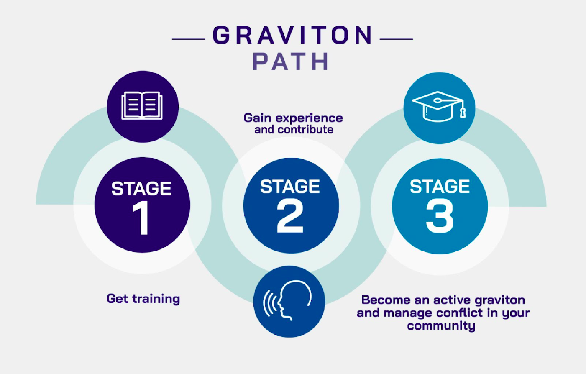

# Education Training

> Explain what is pushing us apart so Gravity can bring us back together.

## CONTINUE THE GRAVITON PATH

## Proposed situations

1. A DAO is debating on how to better govern itself. A part of the community thinks that there should be a small group of 5 to 10 core contributors having leadership roles, and other part of the community thinks that decentralized projects don't need to have a closed leadership. How to foster collective wisdom?

**Proposed tool:** _Centralization vs Decentralization:_ Deep Democracy debate and polarity mapping 

2. You designed a proposal for a DAO along with some colleagues, the proposal was funded and when you started working, frictions started arising. Some of the work was being delayed while the communication was getting worse with the team. The intended impact was not being achieved, and there is no intention of further funding for a continuation of the work being done. Besides looking for alternatives to continue contributing in the DAO, what to do with the relationships that were broken?

**Proposed tool:** _NVC practice:_ assertive communication, mediation.

3. You are loaded with work and you are failing to deliver some of the things that you were supposed to do. You notice that you are not being able to join some of the calls you normally like to participate, and you are leaving a bad impression with the people you were working with. You are not sleeping well and feeling a lot of pressure on your shoulders. You feel that you are blowing things even accidentally. What do you do now?

**Proposed tool:** _Mental health:_ Slow dojo. Communicational bridges and safe spaces. Mental health awareness.

4. You agreed to mediate in a case, and when you are in the first private meeting with one of the parties, they get hyper aroused and start getting triggered by strong emotions. Shortly you find yourself without control of the call, hearing that the mediation process wouldn’t make a difference and being in the position trying to manage and de escalate their reactions without revictimizing or undervaluing the feelings of the party. Your intention is to invite them to trust the mediation process and to have another private meeting, where hopefully, there could be some progress on getting information about what happened, setting a safe space for them to remain in their optimal arousal zone.

**Proposed tool:** _Trauma informed decisions - Harm reduction._

5. One of your teammates is often expressing a different point of view from the main voice that the group takes, The leader of the team thinks that their comments slows down the work, and start trying to avoid giving them space to talk in calls. Shortly after, gossip starts arising that the leader is imposing their ideas and other people in the team agrees with the silenced minority. What to do now?

**Proposed tool:** _Lowering the waterline - Including no voices_

6. A DAO started to fund to some contributors to make a pilot program inside their community. Shortly after the agreement was done, the market dropped 40% and core DAO contributors decided to strengthen financial priorities, cutting the funding to that project and not being able to implement the initial agreement. What to do now?

**Proposed tool:** _Escalation mechanisms - Expectation settings - Unexpected changes._

## Role Play

### Whose fault is it anyways? 

**Description**: you are working on a project in a DAO and you have been preparing for some months to make a public announcement about the release date of your next DeFi tool. Until some weeks ago, the planned date was set in July according to the initial roadmap. But **in last week's team call, one of the lead developers found a critical fail in the smart contracts that allowed re entrancy attacks**. 

It turns out that the **announcement got published on medium that same weekend, saying that the release date would be in July, without mentioning the critical bottleneck** in the smart contracts that could delay the release by a few months. In a public chat, contributors of the team start blaming each other for what happened. The rest of the DAO suggests that the writers and the publishing team has to take shared responsibility and propose alternatives to deal with the situation. 

What do you do now?  Part A: (Writer) Part B: (Publisher) Part C: (Lead dev)

Topics: Error culture. Shared responsibilities. Reconciliation.

## Community Resources
### Peace
- [Gene Sharp How to Start a Revolution](https://howtostartarevolution.org) [Amazon](https://www.amazon.com/Gene-Sharp-How-Start-Revolution/dp/B08LFVRW4F/) [(Chinese subtitles)](https://www.youtube.com/watch?v=Jy2e4RqLv04) 
  > How to Start a Revolution reveals the hidden forces behind the headlines - the strategies passed from the jungles of Burma, to the streets of Iran, the Arab Spring and the looming battle to defend democracy in the West. This is the story of the power of people to change their world, the modern revolution and the man behind it all.
- [Advice for Peace: Ending Civil War in Colombia](https://www.youtube.com/watch?v=iDJ5JRPo7Ss) 
  > The civil war in Colombia lasted 52 years, taking the lives of at least 220,000 people and displacing up to seven million civilians. In 2012, Colombian Presi...
- [Peace and Conflict Fundamentals](https://open.spotify.com/show/2K7KJt6A2R3AZ6QEph9bio?si=W3jZrNNKQhaUqXbXJGYANQ&amp;nd=1) 
  > Listen to Peace and Conflict Fundamentals on Spotify.
- [The Young Peacemaker](https://rw360.org/the-young-peacemaker)
  > The Young Peacemaker is a curriculum that parents, teachers and youth workers can use to teach children how to prevent and resolve conflict in a constructive and biblically faithful manner. The curriculum emphasizes principles of confession, forgiveness, communication and character development, and uses realistic stories, practical applications, role plays and stimulating activities. This detailed and comprehensive […]
