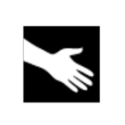
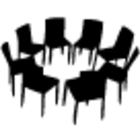
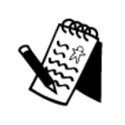
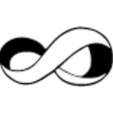
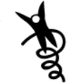
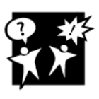
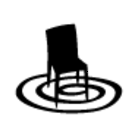

# Trust Creation

- [Beyond Inclusion Beyond Empowerment : Primer](https://soundcloud.com/aloysious-x/beyond-inclusion-beyond-empowerment-primer) 
  > Beyond Inclusion, Beyond Empowerment, by Leticia Nieto Psy.D., and co-authors, brings a long-awaited breakthrough to the fields of liberation and cultural studies. Nieto offers a powerful analysis

## Ethical Standards and requirements for Gravitons

- **Voluntary Process**: All members in the Gravity group and its cases participate without coercion from any actor.
- **Self-Determination**: The Graviton has agency to lead the conflict management process and facilitate communication, but cannot influence on the potential agreement or the specific outcomes of a dispute.
- **Conflict of interest**: Gravitons can express when they are not capable of facilitating a conversation for any possible reason, personal or professional.
- **Competence**: As we are a community of experts, the mediator, besides being trained in Alternative Dispute Resolution, should be able to prove deep understanding of the specific topics that the dispute may be about, or call for help to SMEs.
- **Confidentiality**: Information related to these processes should be handled privately, and strategically shared only with the agreement by the parties. Unwanted information filtered by the mediator is a reason to remove from the Gravity group.
- **Impartiality and neutrality**: The Gravity group members should lead by their example of empathy and acceptance of different points of view, with freedom from favouritism.
- **Professional Responsibility**: Gravity members should assume the task of mediating in the organization with diplomacy and prudence.
- **Rotation**: Two times a year, new trainings and selection processes will be run to encourage members of the community to become part of the Gravity team. We promote rotation in the roles and management of cases to avoid accumulation of power.

See more: [Gravity - Role design](https://forum.tecommons.org/t/gravity-role-design/174) (TECommons Forum)

### Gravitons shall be able to:
- Make an effort to be present and accessible to the community, bringing high vibes and improving relationships, bringing the community together.
- Separate the people from problems. Making parties identify with themselves and the other as equals, rather than centering on their own conflictive thoughts-feelings.
- Self-determinate from all parties and recognize key management points by analyzing the information gathered.
- Promote empathy between conflicting parties with emotional intelligence. Building proximity from the abstraction of the problem and the humanization of apparent antithesis.
- Adapt their mindset for tolerance to conflictive situations, keeping calm and diplomacy to stand as an independent third party.
- Propose alternatives to deal with paradoxes while looking for the coexistence and attraction of opposites.
- Act according to institutional regulations while implementing actions to frame unwanted behavior within rules and boundaries (Terms & conditions / Codes of conduct / Graduated sanctions)

## CREATING A SAFE SPACE

### Empathy is the key

Empathy is necessary to be able to apply certain principles of negotiation, as: 
- Separate people from problems 
- Ease communication between conflicting parties
- Focus in interest and not in positions 
- Generate variety of alternative paths to propose solutions
- Use objective or “credibly neutral” criteria to generate legitimacy and impartiality

Empathy brings us together and helps us to take rational and pacific decisions, because individuals who feels underappreciated or ignored are more prone to fall in irrationality just to defend themselves.

## HELPING PEOPLE TO GET TO THEIR OPTIMAL AROUSAL ZONE

<h3>First actions from the mediator:</h3>

Build confidence, Allow expression, letting steam off, listening carefully, taking notes, asking key questions, identifying feelings, careful language, not trying to influence in any particular idea, just being there to understand the other.

<blockquote>"Trauma can be created by a shock, when its too much too fast, or when its too little too long" - Any of us can get overwhelmed on those situations, where our body triggers the instinctive reactions of flight, fight freeze or fawn. Thanks @MorganxMovement for your teachings today - <a href="https://twitter.com/GravityDAO/status/1534261516458934272">@GravityDAO · Jun 7, 2022</a></blockquote>

<a href="https://apn.com/resources/fight-flight-freeze-fawn-and-flop-responses-to-trauma/">FIGHT, FLIGHT, FREEZE, FAWN, AND FLOP: RESPONSES TO TRAUMA</a>

## Overcoming communication constraints

### Nonviolent Communication (Giraffe / Wolf language)

[Marshall Rosenberg on Giraffe/Jackal Language](https://www.youtube.com/watch?v=Xov5z_GJ9Zs)
[Marshall Rosenberg “Giraffe Fuel For Life”](https://www.youtube.com/watch?v=RSwEC4yvrb0)

## The four components of NVC

**NVC - OFNR process**
### OFNR:
- Make **OBSERVATIONS** without evaluations
- Identifying and expressing **FEELINGS** while taking responsibility for them.
- Uncover the fundamental **NEEDS** triggering the parties, moving the conversation to basic levels of human understanding.
- **REQUEST** That Which Would Enrich Life,  instead of making demands.

[The 4 NVC STEPS MADE SIMPLE (VIDEO)](https://www.youtube.com/watch?v=NYkgbrZSAY0)

## The collective consciousness Iceberg

## Liberating Structures Toolbox

Liberating Structures is an open tool-kit for facilitation.

| | | |
|---|---|---|
|    **1-2-4-All**   Engage everyone simultaneously in generating questions/ideas/suggestions |    **25-To-10 Crowd Sourcing**   Rapidly generate & sift a group’s most powerful actionable ideas |    **What I Need From You**   Surface essential needs across functions and accept or reject requests for support |
|    **Impromptu Networking**   Rapidly share challenges and expectations, building new connections |    **Wise Crowds**   Tap the wisdom of the whole group in rapid cycles |    **Open Space**   Liberate inherent action and leadership in large groups |
|    **9 Whys**   Make the purpose of your work together clear |    **Min Specs**   Specify only the absolute “Must do’s” & “Must not do’s” for achieving a purpose |    **Generative Relationships**   Reveal relationship patterns that create surprising value or dysfunctions |
|    **Wicked Questions**   Articulate the paradoxical challenges that a group must confront to succeed |    **Improv Prototyping**   Develop effective solutions to chronic challenges while having serious fun |    **Agreement-Certainty Matrix**   Sort challenges into simple, complicated, complex and chaotic domains | 
|    **Appreciative Interviews**   Discover & build on the root causes of success |    **Helping Heuristics**   Practice progressive methods for helping others, receiving help, and asking for help |    **Simple Ethnography**   Observe and Record Actual Behaviors of Users in the Field | 
|    **TRIZ**   Stop counterproductive activities & behaviors to make space for innovation |    **Conversation Café**   Engage everyone in making sense of profound challenges |    **Integrated~Autonomy**   Move from either-or to robust both-and solutions |
|    **15% Solutions**   Discover & focus on what each person has the freedom and resources to do now |    **User Experience Fishbowl**   Share know-how gained from experience with a larger community |    **Critical Uncertainties**   Develop strategies for operating in a range of plausible yet unpredictable futures |
|    **Troika Consulting**   Get practical and imaginative help from colleagues immediately |    **Heard, Seen, Respected**   Practice deeper listening and empathy with colleagues |    **Ecocycle Planning**   Analyze the full portfolio of activities & relationships to identify obstacles and opportunities for progress |
|    **What, So What, Now What?**   Together, look back on progress to-date and decide what adjustments are needed |    **Drawing Together**   Reveal insights & paths forward through non-verbal expression |    **Panarchy**   Understand how embedded systems interact, evolve, spread innovation, and transform |
|    **Discovery & Action Dialogue**   Discover, spark & unleash local solutions to chronic problems |    **Design StoryBoards**   Define step-by-step elements for bringing projects to productive endpoints |    **Celebrity Interview**   Reconnect the experience of leaders and experts with people closest to the challenges at hand | 
|    **Shift & Share**   Spread good ideas and make informal connections with innovators |    **Social Network Webbing**   Map informal connections & decide how to strengthen the network to achieve a purpose |    **Purpose-To-Practice**   Define the five elements that are essential for a resilient & enduring initiative |

## Ho Oponopono

#### ありがとう - Te Amo - Désolé - I’m sorry
#### Gracias - Je t’aime - Forgive me, ごめんなさい
#### Thank you - 愛してる - Lo siento - Pardonnez-moi
#### Merci - I love you - すみません - I’m Sorry

[https://www.youtube.com/watch?v=OAuWRuU4uzA](https://www.youtube.com/watch?v=OAuWRuU4uzA)

## No difference between legitimacy of social law and other types of law.

Following the principles of self governance and self sovereignty, despite the lack of central authorities, we can rely on the social acceptance of internal contracts to create binding procedures, as a basis for participation inside the community.

The point of these processes[k][l] (to have clear roles in the organization played by a group of people accountable of managing the disputes sent to the system, by periodically applying and reviewing transformational actions, and conflict management scaling protocols for complex problems) are to be able to have antifragile systems that set guidelines for resisting frictions in human interaction. 

## Making rules is not just blindly following a system.

To monitor the system’s stability, there must be a clear definition of who are the individuals accountable for managing disputes and promoting the ethical values of the organization in decision taking, rewards and reasonable graduated sanction designs. This group is responsible for developing trust between members, and it’s decisions, or members can be revoked if the majority of the community approves a proposal stating it’s contradiction to social agreements. 

## Correcting contradictory social law behavior

Sanctions are a necessary evil. In order to play exciting games, there must be fast responses to unwanted behavior that can help to easily address common issues and keep playing without much traumatism (like in sports). 

\*I suggest that after a certain time[m][n], accumulated sanctions are erased.

* Light sanctions serve as verbal warnings -to actions that affected other game players without intention to do so, and take place for the first times. 
* Medium sanctions  serve as yellow cards -that are tracked for intentional harm, and the registry of continuing unwanted behavior for a period of time. (duration 6 months)
* Hard sanctions serve as “red cards” that can be called for suspension of privileges of a member through a period of time, for hardly endangering others wellbeing (with or without intention), and persistent unwanted behavior with medium sanctions -This could include removing cstk tokens, banning from community calls, request for external arbitrage and traditional legal actions[o]. (duration from 1 year to 2 years)

## Promoting strategic nonviolent communication

Even though transparency is an ethical value inside the organization, there is no need for making all disputes public. Instead, all conflict management processes should start [p][q]private [r][s]and begin including actors in the conversation by strategic need. 

I suggest the queries can be sent to a bot or a typeform, that is associated to a spreadsheet with a distribution figure that assigns cases equally to each conflict manager so that just sending a message connects you to someone able to manage the situation, lift information about the issue from the parts involved, and suggest sanctions according to the tiers, or help scaling the conflit if it becomes complex to address. This could serve as a database of disputes that can be periodically reviewed to update tiers by nurturing from the insights generated of conflict management practices and unpredicted social behavior. (Also if the person that receives a query declares himself unable to handle the query, they can skip this case and then the dispute is assigned with the distribution figure to another person) -Ex. My brother is involved in a case.

### Group Activity
- [Wise Crowds - Tap the Wisdom of the Whole Group in Rapid Cycles (15 min. per person)](https://www.liberatingstructures.com/13-wise-crowds/) ([Youtube](https://www.youtube.com/watch?v=yCFRcLGsUOA&list=PLBlnEMjx5Jb0mqcZkkUqp8EIYfp1hssqs))
  > Exploring how to create the worst possible outcomes in this Design Call Space with TRIZ
  > 
  > Approaching an introduction/sampler training session for Attention Exercises/Practices with What, So What, Now What 
- [TEC icebreaking game — Gatheround — Crack the culture code](https://icebreaker.video/events/GRgR0mLvZk3CaYKMpOBO) 
  > Let’s know a little bit more about each other!

## Gravity WG Practice

- [W49 Gravity WG: Liberating structures - Accepted and Non-accepted violence](https://www.youtube.com/watch?v=kExHpkju7I8&list=PLusWL9gf0FIQaR-no0Tx6x9NOwSRhL4t9&index=26)
- [W47 Gravity WG: Liberating structures - Deep democracyand the resistance line!](https://www.youtube.com/watch?v=vJDKXBfE2gE&list=PLusWL9gf0FIQaR-no0Tx6x9NOwSRhL4t9&index=28)
- [W45 Gravity WG:Wicked Questions, Integrated Autonomy, liberating structure w/Jeremy&Lean](https://www.youtube.com/watch?v=QXyqBc0jMy4&list=PLusWL9gf0FIQaR-no0Tx6x9NOwSRhL4t9&index=30)
- [W39 Gravity WG: Practice Groups on Deep Democracy and Liberating Structures](https://www.youtube.com/watch?v=6wYxzTem8JU&list=PLusWL9gf0FIQaR-no0Tx6x9NOwSRhL4t9&index=36)
- [W41 Gravity WG: Practice group liberating structure w/Jeremy](https://www.youtube.com/watch?v=VuwFX7uLTSQ&list=PLusWL9gf0FIQaR-no0Tx6x9NOwSRhL4t9&index=34)
- [W42 Gravity WG: Practice group liberating structure w/Jeremy&Lean](https://www.youtube.com/watch?v=Gd_s4fv_dSU&list=PLusWL9gf0FIQaR-no0Tx6x9NOwSRhL4t9&index=33)
- [W51 Gravity WG: Practice Groups - Inclusive Decisions](https://www.youtube.com/watch?v=k8lQjqSx10o&list=PLusWL9gf0FIQaR-no0Tx6x9NOwSRhL4t9&index=24)
- [W53 Gravity WG: Practice Groups - Invitations & Check In Wave](https://www.youtube.com/watch?v=nfPv43fC_R8&list=PLusWL9gf0FIQaR-no0Tx6x9NOwSRhL4t9&index=21)
